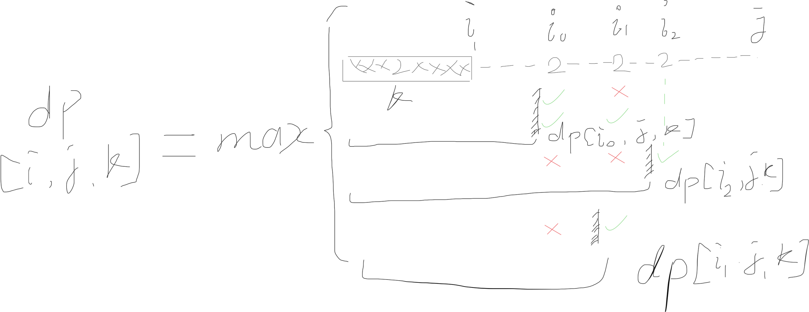

# 动态规划的两个条件

- 最优子结构：可以用贪婪策略，将问题划分为子问题

- 重叠子问题：避免重复计算

最难的是列出状态转移公式。

## 常见的几种例子

### 数列max

[0312. Burst Balloons](../problems/0312.ts)
*难度：⭐️⭐️⭐️⭐️⭐️*

这里的状态转移公式是：
```
Max(i, j) = max{k=i,...n,...,j}{Max(i,k-1) + nums[i-1]*nums[k]*nums[j+1]+Max(k+1,j)}
```
(作者花了将近3天时间才推出公式来)

#### 数列max + 3D dp

和burst ballons类似的动规题目，只不过使用了3d dp. [0546. Romove Boxes](../problems/0546.ts)



[1524. Number of Sub-arrays With Odd Sum](../problems/1524.ts)
*难度：⭐️⭐️⭐️*

状态转移公式使用了两个`dp`变量：
```typescript
if (v % 2 === 0) {
    dpOdd = (dpOdd) % base;
    dpEven = (dpEven + 1) % base;
    ret = (ret + dpOdd) % base;
} else {
    const lastDpOdd = dpOdd;
    dpOdd = (dpEven + 1) % base;
    dpEven = (lastDpOdd) % base;
    ret = (ret + dpOdd) % base;
}
```

[0873. Length of Longest Fibonacci Subsequence](../problems/0873.ts)
*难度：⭐️⭐️*

典型的重复计算子问题。

[1092. Shortest Common Supersequence](../problems/1092.ts)
*难度：⭐️⭐️⭐️*

这里的状态转移公式是：
```
dp[i+1][j+1] + 1 if str1[i] == str2[j]
dp[i+1][j] + 1 if str1[i] != str2[j] but choose str1[i]
dp[i][j+1] + 1 if str1[i] != str2[j] but choose str2[j]
dp[i][j] = min(dp[i+1][j+1], dp[i+1][j], dp[i][j+1])
```

### 背包问题/选或不选问题
给定一个序列，选择背负这个包裹还是不去选择这个包裹，都会对子问题产生影响。
```
dp[i] =
Min(dp[i+1] + cost(["Select"]),
dp[i+1] + cost["drop"])
```

#### [0322. Coin Change](../problems/0322.ts)

动态转移公式是：
```
dp[i][amount] = Min(dp[i+1][amount] + 0,
dp[i+1][amount-coin] + 1, dp[i+2][amount - 2*coin] + 2, ..., dp[i+1][amount-n*coint] + n)
```

#### [0213 Rob house](../problems/0213.ts)

