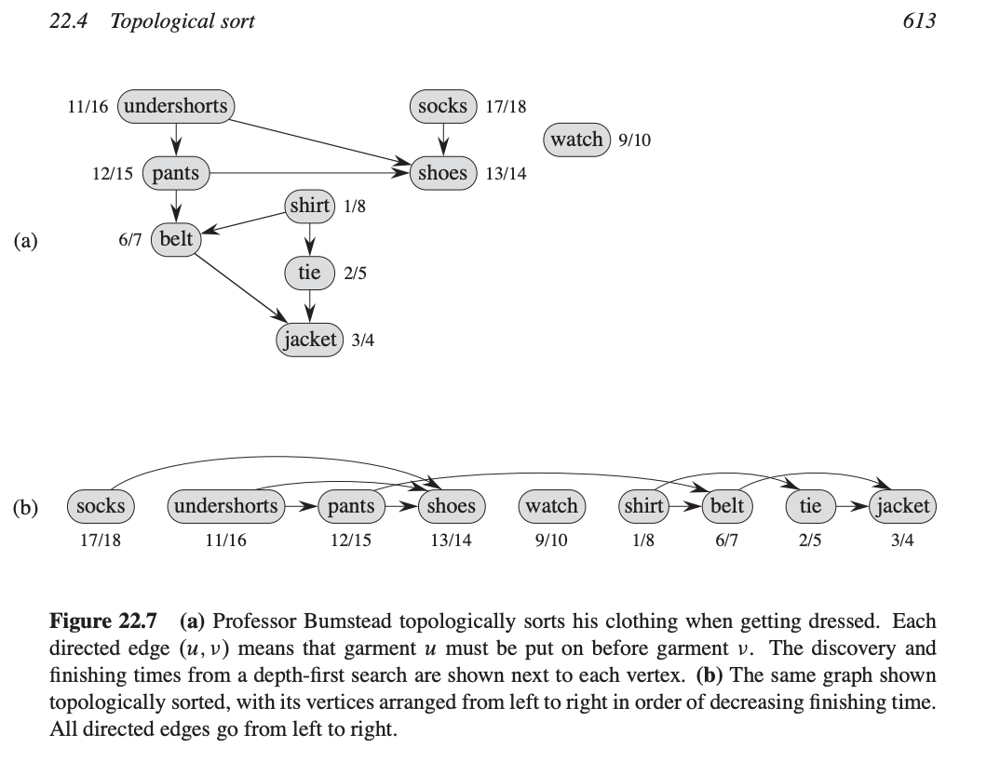
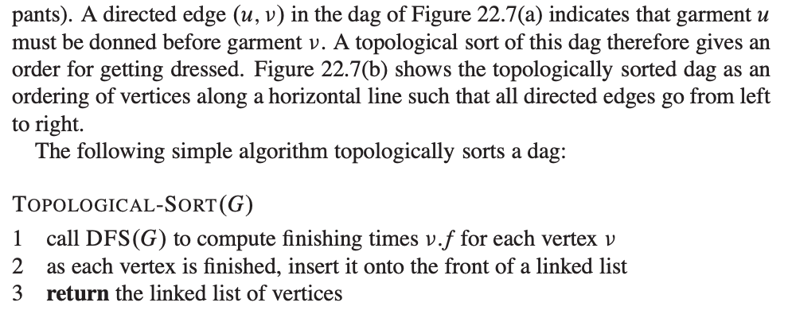

# 拓补排序
## 解决的问题
针对一组有依赖关系的事件，进行排序使得有最优解。

# problem

## [Course Schedule](../../problems/0207.ts)
题目中用到了闭环检测算法,见[CycleChec](../CycleCheck.md).

## [Course Schedule II](../../problems/0210.ts)
使用**发现时间**和**完成时间**来标定节点，并对完成时间进行降序排序，得到排序后的拓补结构。

### Visualization of topology sort


### Algorithm



```ts
export function topologicalSort(vertexs: TopologyDagVertex[]) {
    let discoverTime = 0;
    if (vertexs.some(v => v.outSet.has(v))) {
        return [];
    }
    if (detectCycle(vertexs)) {
        return [];
    }
    const vertexsZeroInDegree = vertexs.filter(v => v.inDegree === 0);
    vertexsZeroInDegree.forEach(v => v.visited = false);
    if (vertexsZeroInDegree.length === 0) {
        return [];
    }
    for (const vertex of vertexsZeroInDegree) {
        if (!dfs(vertex, discoverTime)) {
            return [];
        }
        discoverTime = vertex.finishTime + 1;
    }
    const vertexsSorted = vertexs.sort((a, b) => b.finishTime - a.finishTime);
    return vertexsSorted.map(v => v.key);

}

function dfs(vertex: TopologyDagVertex, discoverTime: number) {
    if (vertex.color === NodeColor.gray) {
        return false;
    }

    vertex.color = NodeColor.gray;
    vertex.discoverTime = discoverTime;
    let discoverTimeNew = discoverTime + 1;
    for (const v of vertex.outEdges) {
        if (v.color === NodeColor.black) {
            continue;
        }
        if (!dfs(v, discoverTimeNew)) {
            return false;
        }
        vertex.addOutEdge(v);
        discoverTimeNew = v.finishTime + 1;
    }
    vertex.color = NodeColor.black;
    vertex.finishTime = discoverTimeNew;
    return true;
}
```