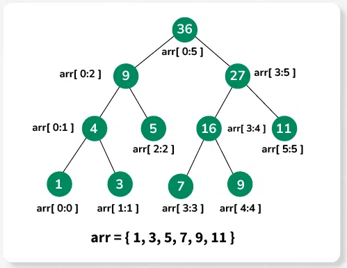

Segment Tree is a versatile data structure used in computer science and data structures that allows efficient querying and updating of intervals or segments of an array. It is particularly useful for problems involving range queries, such as finding the sum, minimum, maximum, or any other operation over a specific range of elements in an array. The tree is built recursively by dividing the array into segments until each segment represents a single element. This structure enables fast query and update operations with a time complexity of O(log n), making it a powerful tool in algorithm design and optimization.

